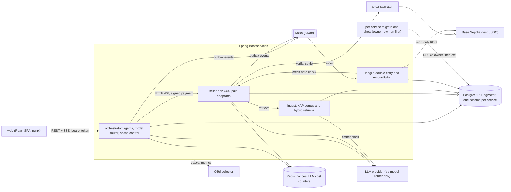
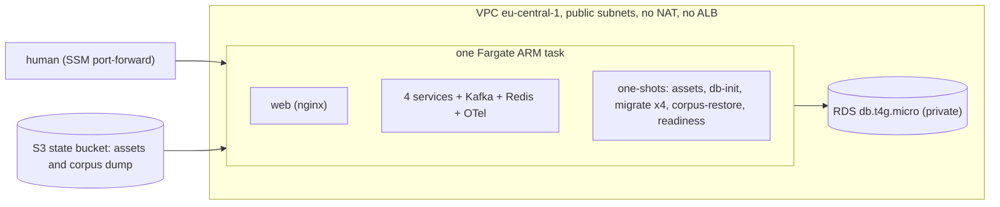

# sAIman

*From Turkish "sayman" — treasurer.*

**The AI treasurer for research agents.** Agents research BIST companies and crypto assets, pay for data and tools per request over [x402](https://x402.org) (HTTP 402 + stablecoin, Base Sepolia testnet), stay inside budgets enforced in code — never by the model — and every payment lands in a double-entry ledger that always balances and is reconciled against the chain.

> Status: milestones M0-M6 are built (see [docs/PLAN.md](docs/PLAN.md) and [docs/PROGRESS.md](docs/PROGRESS.md)). The remaining steps are human-only and **not done yet**: applying the AWS bootstrap, one live AWS session with capture, and publishing the replay on Cloudflare Pages. Until then there is **no public demo URL**: the markers "TBD (human step)" below stand for exactly these steps.

## What's inside

- **x402 Spring Boot starter** — `@RequiresPayment` for sellers, a `RestClient` interceptor with a spend guard for buyers. A native x402 v2 implementation (`exact` scheme, EVM, Base Sepolia only; the official Java SDK is v1-only and is used as a reference — ADR-0008).
- **Agents on Spring AI 2.0** — planner → researcher → risk → synthesis, with a model router (cheap models for routine steps, stronger ones where it matters) and a data-classification policy.
- **Spend control** — per-run budgets, daily caps, payee allowlists, idempotency and human approval above a threshold, all checked before anything is signed.
- **Ledger** — double-entry, inbox/outbox, Kafka events, on-chain reconciliation.
- **RAG + evals** — hybrid retrieval over public KAP disclosures, with an eval harness that reports quality *and* USD per task.

## Quickstart (local)

Prerequisites are in [docs/SETUP.md](docs/SETUP.md): JDK 25, Node 22 + pnpm, Docker.

```bash
make help                      # list targets
make up                        # build images, start infra + services, wait for health
make test && make lint         # Gradle check (incl. Testcontainers) + web tests/lint
make web-dev                   # Vite on http://localhost:5173, proxies /api and /otlp
```

`make up` also builds the dashboard and serves it, with the APIs behind one origin, at
**http://localhost:8088** (nginx; local and testnet only). Start a research run on **Start a research
run**, approve the payment when asked (payments above 0.01 USDC wait for you, and approval never raises the
run budget), then follow it on the run page: payments, the report with citations and, a few seconds
later, **In the ledger**. The other pages show runs, approvals, spend control, the ledger with its
balance check, reconciliation against Base Sepolia and seller revenue (per books next to the
chain-verified figure). `make e2e` runs the browser tests against a fixture server, `make lighthouse`
the accessibility gate and `make e2e-live` the acceptance flow against the running stack (a real, tiny
testnet payment).

For development, `pnpm --dir web dev` serves http://localhost:5173 with the same proxy. Press **Check
again** on the System check card, then verify the
trace (browser → orchestrator → Postgres) in Jaeger:

```bash
make verify-trace TRACE_ID=<traceId shown on the card>   # or open the card's Jaeger link
make verify-trace                                       # no browser: orchestrator → Postgres only
```

Jaeger UI: http://localhost:16686. Redis is published on host port **16380** (not 6379), because
6379 and 16379 clash with a native Redis on Windows; if 16380 is taken too, run
`export REDIS_HOST_PORT=<port>` before `make up`. `make down` stops everything; `make clean` also
drops volumes.

## Secrets for M2 (RAG)

`ingest` needs the MKK API credential and an OpenAI key; `seller-api` needs the OpenAI key.
Both live as files under the ignored `secrets/` directory and reach only those containers as
compose secrets (ADR-0009); they are never environment variables. `make up` creates missing
files as empty ones (the apps then fail closed when they need them). The two mounted files
are mode 0644 inside the 0700 `secrets/` directory: the container user's uid differs from
yours, so 0600 would be unreadable in the container. The directory mode is the protection.

```bash
mkdir -p secrets && chmod 700 secrets
read -rs MKK && printf '%s' "$MKK" > secrets/mkk_credentials && unset MKK && chmod 644 secrets/mkk_credentials   # paste the portal's base64 value
make secrets-from-dotenv        # copies only OPENAI_API_KEY from .env to secrets/openai_api_key (0644); FORCE=1 to overwrite
make secrets-check              # present / empty / absent + file mode per secret, never contents
```

M3 adds `secrets/x402_buyer_private_key`: the orchestrator's throwaway **testnet** buyer key,
created by you only (nothing generates or copies it; never commit it). `make up` creates an
empty placeholder so compose can start; with it empty the orchestrator fails closed at
startup and stays down (the other services run) until you fill it (0644 inside the 0700 directory, same reason as above). Then `make research-run
RUN_QUESTION='...'` starts a run and streams its events; `make research-approve` and
`make research-status` decide approvals and show a run.

Then `make infra-up && make ingest-backfill` loads disclosures, `make ingest-status` shows
per-ticker progress, and `make rag-ask` pays (test USDC) for a question.

## M4: ledger and reconciliation

With `make up`, the ledger (port 8082, loopback only; its `/api/v1/**` needs a bearer token since M6, ADR-0023) books payment
events into a double-entry ledger and reconciles them against Base Sepolia through the public
RPC. `make recon-run` triggers a run, `make recon-report` prints and saves the latest report
(`build/reports/reconciliation/latest.json`), `make ledger-balance` shows the trial balance, and
`make ledger-tamper-demo` (local compose only) corrupts a SALE entry on purpose so the next
`make recon-run recon-report` shows a mismatch.

## Quickstart (x402, Base Sepolia testnet)

The x402 starter is fail-closed: `make up` refuses to start without a valid seller payout
address, and seller-api won't come up without one either. Everything here is **testnet only**
(rule 1) — test USDC has no value, and every wallet below is throwaway.

1. **Create two throwaway wallets** (a seller payout address, a buyer signing key) with any
   wallet tool, e.g. [Foundry](https://getfoundry.sh)'s `cast wallet new`, or:
   ```bash
   make x402-new-wallet                    # writes secrets/buyer.key (0600), prints only the address
   ```
   Put the seller address in `.env` (copy it from `.env.example` first) as
   `X402_SELLER_PAYTO_ADDRESS=0x...` — never the private key, and never commit `.env` or
   `secrets/`. `make` reads only this one public variable from `.env`; everything else (LLM
   keys, the buyer key) must be exported in your shell or left in `secrets/`.

2. **Fund the buyer** from the [Circle testnet faucet](https://faucet.circle.com/) (Base Sepolia,
   20 test USDC every 2 hours, no account needed) — paste the buyer's **address**, not the key.
   The buyer needs no ETH: EIP-3009 payments are gasless for the payer.

3. **Start the stack** and pay for the one paid endpoint:
   ```bash
   make up                                 # fails fast if X402_SELLER_PAYTO_ADDRESS is missing/invalid
   export X402_BUYER_PRIVATE_KEY=0x...     # or rely on secrets/buyer.key from step 1
   make x402-buy                           # pays seller-api's disclosure summary (0.01 test USDC) and prints the tx hash
   ```
   `make x402-buy` prints a [BaseScan](https://sepolia.basescan.org) link for the settlement
   transaction. `make x402-replay` resends the same signed payload and must get **402** back
   (replay protection); `make x402-testnet-check` does a read-only `/verify` call against the
   public facilitator (never `/settle`, moves no funds).

See [docs/THREAT_MODEL.md](docs/THREAT_MODEL.md) for what's guaranteed (and what isn't yet) about
key custody, replay and settlement, and [docs/design/m1-x402.md](docs/design/m1-x402.md) for the
wire-level contract.

## M6: API tokens, evals, replay

**API tokens (ADR-0023).** The orchestrator and ledger APIs need a bearer token. `make up` generates random tokens under `secrets/` (git-ignored; `make auth-tokens` shows where they are, `make auth-token-copy ROLE=reader|operator` copies one to the clipboard on request). A *reader* token shows everything; an *operator* token can also start runs, decide approvals and run reconciliation. Open http://localhost:8088, press **Connect** and paste a token. **The dashboard keeps the token in the page's memory only** (ticking "Keep for this tab" also stores it in `sessionStorage`, which is cleared when the tab closes; Disconnect clears both). It is never written to `localStorage` (an ESLint rule and a test enforce it), never put in a URL, and sent only in the `Authorization: Bearer` header, including on the event stream, which the app reads with `fetch` rather than `EventSource`. A reload asks for the token again unless you kept it for the tab, and any script running in the page could read a held token, so the tokens are static, have no expiry and are rotated by deleting the file and redeploying. OIDC/JWT is the documented upgrade path. Services run as per-service Postgres roles with no superuser (ADR-0024), and Flyway runs as the owner role only in a per-service migrate one-shot (ADR-0027); `make psql` opens a superuser shell over the container's socket.

**Evals (ADR-0025).** `make eval` runs the golden set against ingest's retrieval (about $0.00002) and writes `docs/evals/latest.md`, `latest.json` and `runs/`; `make eval EVAL_ANSWERS=1` also asks the real answer service (about $0.06 per 30 questions through the day-capped model router). Questions include a freshness check ("THYAO son özel durum açıklamaları"); the corpus is a frozen 2023 snapshot, so "latest" means latest in the corpus. Method, golden set and numbers: [services/evals/README.md](services/evals/README.md), [docs/evals/README.md](docs/evals/README.md).

**Replay (ADR-0026).** `make capture-demo` exports a run set from the running stack (reader token, scrubbed of nonces, signatures, keys and internal hostnames) as a capture file; `VITE_DEMO_MODE=replay pnpm --dir web build` produces a static, always-replay dashboard with a banner saying the data is recorded. When the daily model budget is used up, `POST /api/v1/runs` answers 503 `LLM_DAILY_CAP_REACHED` and the dashboard offers the recorded demo. The replay banner shows the corpus snapshot date; a capture may carry per-run annotations (the failed ASELS run is labelled as such).

## Architecture



Spend limits, payee allowlist and idempotency are deterministic code in the orchestrator's spend-control plane (Redis + Postgres), never a prompt. Each service connects as a DML-only `<svc>_app` role; the `<svc>_owner` password exists only in that service's `<svc>-migrate` one-shot, which the service waits for and which then exits (ADR-0024, ADR-0027). Component table, paid-call flow and model routing: [docs/ARCHITECTURE.md](docs/ARCHITECTURE.md).

**AWS demo-lite topology (ADR-0028).** Not a second system, just the same containers in one place for a few hours: one Fargate ARM task (2 vCPU / 8 GB) with every container on localhost, including Kafka and Redis, and a private RDS `db.t4g.micro`. No load balancer and nothing exposed to the internet; the human reaches the `web` container through an SSM port-forward.



## Cost

Only figures that exist in this repository are listed; each cites its source. Nothing here is a measured AWS bill.

| Item | Figure | Source and status |
|---|---|---|
| LLM, one eval answer (Tier A) | mean $0.001133 per answered question; $0.010193 for 9 questions; p95 10 s | [docs/evals/latest.md](docs/evals/latest.md), run `dd7a79f` (measured) |
| LLM, retrieval eval (Tier R) | about $0.00002 per run (19 embeddings) | [docs/evals/latest.md](docs/evals/latest.md), [ADR-0025](docs/adr/0025-eval-harness.md) |
| LLM, one research run | $0.0069 (live run `6ad4354c`, 3 settled payments); 4756 micro-USD (about $0.0048) for run `37f3afbd`, 2 settled payments | [docs/PROGRESS.md](docs/PROGRESS.md), M3 T6 and M3 T7 entries (measured, two runs; not an average) |
| LLM caps | $0.15 per run, $0.70 per day (router hard ceiling, shared by all services) | `services/orchestrator/src/main/resources/application.yaml` (`llm-budget-usd-micros: 150000`), [docs/ARCHITECTURE.md](docs/ARCHITECTURE.md), [docs/THREAT_MODEL.md](docs/THREAT_MODEL.md) |
| x402 price per paid call | 0.01 test USDC (disclosure summary), 0.02 test USDC (disclosure questions); test USDC has no value | `services/seller-api/src/main/resources/application.yaml` |
| x402 limits per run | run budget 0.05 USDC by default (max 0.20), approval above 0.01 USDC, daily cap 1 USDC | `services/orchestrator/src/main/resources/application.yaml` |
| AWS demo-lite, one 4-hour session | about $0.55-0.80 | [ADR-0028](docs/adr/0028-demo-lite-on-aws.md). **Hand estimate from published rates, not measured, not an Infracost output.** It supersedes the older "about $1-3" in ADR-0004 |
| AWS idle (only the bootstrap stack remains) | about $0.003 per month (state bucket) | [ADR-0028](docs/adr/0028-demo-lite-on-aws.md) (estimate); the OIDC provider and IAM roles are free |
| Public replay hosting | $0 (Cloudflare Pages free tier) | [ADR-0004](docs/adr/0004-hybrid-deployment.md) (design target; TBD (human step): deploy) |
| Infracost estimate | pending (needs `INFRACOST_API_KEY`) | TBD (human step): CI credentials; the CI workflow has no Infracost step yet |
| `make cost-report` | not implemented yet | listed in CLAUDE.md; the router exports cost metrics and each run row stores its LLM cost, but there is no summary script |

## Evals

`make eval` is free (retrieval only); `make eval EVAL_ANSWERS=1` also asks the real answer service. The corpus is a frozen 2023 KAP snapshot, so "latest" means newest in the corpus. Scoring is deterministic: there is no LLM judge, because ADR-0003 wants a judge from another model family and that needs new provider keys ([ADR-0025](docs/adr/0025-eval-harness.md)). No cross-provider route comparison has been run.

Committed report: [docs/evals/latest.md](docs/evals/latest.md) (generated 2026-10-05, git sha `dd7a79f`, corpus `24303757d747de77`, topK 10; machine-readable [latest.json](docs/evals/latest.json), history in [docs/evals/runs/](docs/evals/runs/)).

| Kind | n | Metric | Value |
|---|---:|---|---:|
| RETRIEVAL | 16 | Recall@10 | 0.927 |
| RETRIEVAL | 16 | MRR@10 | 0.911 |
| RETRIEVAL | 16 | nDCG@10 | 0.870 |
| RETRIEVAL | 16 | p95 latency | 1158 ms |
| FRESHNESS | 3 | recency@5 | 0.533 (baseline before the recency leg: 0.067) |
| FRESHNESS | 3 | latestHit@5 | 0.667 (baseline 0.333) |
| FRESHNESS | 3 | nDCG@10 | 0.720 (baseline 0.181) |
| ANSWER | 5 | taskSuccess, factRecall, citationRecall, citationValidity | 1.000 each |
| UNANSWERABLE | 2 | refusalCorrect | 1.000 |
| TEMPORAL | 2 | temporalSuccess, relativeTimeFree | 1.000 each |

What the tiers measure: RETRIEVAL asks whether the right disclosure is in the top 10; FRESHNESS asks whether a "latest" question returns the 5 newest disclosures of the ticker; the answer tier (ANSWER, UNANSWERABLE, TEMPORAL) runs the seller's real prompt and checks required date facts, citation validity and recall, correct refusals and the absence of relative-time wording ("in the last 7 days") on a frozen corpus. **Read the answer tier with care:** n is 2 to 5 per kind, every ANSWER item is saturated (it cannot tell models or prompts apart), and an earlier run scored taskSuccess 0.000 because the labels were single-source while the service needs two citations; that was a label error, fixed and documented in [docs/evals/README.md](docs/evals/README.md). The recency leg is a clear improvement, not a fix: "THYAO son özel durum açıklamaları" still misses the newest disclosure (latestHit 0). The baseline figures come from [docs/evals/README.md](docs/evals/README.md); method and golden set: [services/evals/README.md](services/evals/README.md).

## Deploying the AWS demo

The cloud part is on demand and human-triggered: nothing is applied by an agent or by CI `plan` (CLAUDE.md rule 7; the one relaxation is TTL expiry, ADR-0028). Details, roles and offline checks: [deploy/terraform/aws/README.md](deploy/terraform/aws/README.md). The human-only steps, in order:

1. **Bootstrap apply (once):** state bucket, GitHub OIDC provider, three roles (`plan`, `apply`, `destroy`) and the permissions boundary. Then the two GitHub environments (`demo-apply`, `demo-destroy`, `main` only, admin bypass off) and the repository variables.
2. **`demo-up`:** brings the stack up with a TTL (the reaper and EventBridge Scheduler stop an expired demo).
3. **Capture:** `make capture-demo` against the running stack ([ADR-0026](docs/adr/0026-replay-mode-and-daily-cap-fallback.md)); also the video and screenshots.
4. **`demo-down`**, then **check** that only the bootstrap stack remains (`check-demo-down.sh` fails otherwise).
5. **Publish the replay** on Cloudflare Pages (`VITE_DEMO_MODE=replay`).

Status of the evidence this README is supposed to carry (PLAN M6 acceptance):

- Public replay URL: TBD (human step): needs steps 3 and 5. The replay app is built and says on every screen that the data is recorded.
- `terraform plan` output: TBD (human step): the CI `plan` job needs the OIDC plan-role variable (called `AWS_PLAN_ROLE_ARN` in the task plan; the Terraform README names the repository variable `PLAN_ROLE_ARN`). CI today runs only the offline checks (`fmt`, `validate`, `test`).
- Infracost estimate: TBD (human step): needs `INFRACOST_API_KEY`.
- `demo-up` / `demo-down` workflows and `check-demo-down.sh`: described in ADR-0028 and the Terraform README but not on this branch yet; check `.github/workflows/` before relying on them.

## How I'd scale this

Each item is tied to a limit that is already documented; none of it is built.

- **One task becomes per-service tasks (ADR-0028).** `demo-lite` runs everything on localhost in one Fargate task, so all containers share one task role. The `enterprise` profile (EKS, Helm, Service Connect between separate workloads) restores per-service identity and scaling; it is a stretch goal in [docs/PLAN.md](docs/PLAN.md).
- **Managed Kafka (ADR-0020).** One KRaft node is fine for a handful of events per run; MSK is the named option when partitions, replication and retention matter, together with Kafka ACLs, which are not set today ([docs/THREAT_MODEL.md](docs/THREAT_MODEL.md), "Not done in M6").
- **Real identity instead of static tokens (ADR-0023).** Tokens have no expiry and no per-user identity, and any READER can read any run's stream. JWT/OIDC with per-run ownership is the documented upgrade path.
- **Redis auth and ACLs.** Redis holds the nonce store and the LLM cost counters and is unauthenticated on the compose network, reachable from every app container; per-service ACL users and network scoping are the listed remediation.
- **Per-payer limits before verify and settle.** Since the upfront flow (ADR-0021) every request settles before it runs, so over-limit and malformed requests are paid and then credited. Limiting on the recovered payer address before `/verify` (or a pre-settle veto hook) is open in the threat model's known gaps.
- **Facilitator redundancy.** The public x402.org testnet facilitator is a single dependency that sometimes fails a settlement (4 of 18 in the local seller book; see Known limits); `/verify` and `/settle` share one circuit breaker. Separate breakers, a second facilitator or a self-run one are the next steps.
- **Per-service LLM keys and caps.** One $0.70/day counter is shared by seller-api, ingest and the orchestrator, so one caller can exhaust it for all (replay mode keeps the demo honest when it does). Per-service sub-caps bound availability, not only spend.
- **Multi-region.** Everything is `eu-central-1` and the demo database is a single `db.t4g.micro` with no backups by design. Multi-region would need Postgres replication and a facilitator and RPC story per region; nothing in the repo measures that yet.
- **Real key custody.** Wallet keys are environment variables or ECS secrets on a testnet. Anything beyond testnet needs KMS or HSM signing behind the spend guard, and is outside this project's scope (CLAUDE.md rule 1).
- **Eval-driven routing.** The tiers in [docs/ARCHITECTURE.md](docs/ARCHITECTURE.md) are chosen from public benchmarks. The harness could re-check them on this corpus (tier1 route comparison, an independent LLM judge), but that needs new provider keys and a larger golden set than the current n = 2 to 5 answer items.

## Known limits

- **Paid but not served (ADR-0015, ADR-0021).** The RAG endpoints use the x402 `upfront` flow: the seller settles before it runs the paid LLM call, so no unpaid LLM run exists and the old unsettled-day-budget exhaustion is gone. The price is that every non-2xx answer after settlement (including the buyer's own mistakes, e.g. an unknown ticker) is paid; the seller has no key for on-chain refunds, so it records a full credit note (a liability in the ledger). Credits cannot be redeemed yet.
- **Frozen corpus, no "recent".** The answers come from a frozen MKK KAP snapshot: the newest disclosure is from **29 Dec 2023** (ADR-0010); the dashboard shows this date (live landing page and replay banner). A model can still invent relative time (an early demo answer said "no new disclosure in the last 7 days"): the answer prompt now forbids relative-time wording and states the snapshot date, and the eval set has `TEMPORAL` items that check answers for relative-time expressions (ADR-0025); this is a mitigation, not a guarantee.
- **Intermittent facilitator failures.** The x402.org testnet facilitator sometimes rejects a settlement with `invalid_exact_evm_transaction_failed` (4 of the 18 settlements in the local seller book, the last two in the recorded ASELS demo run, which is published as a labelled failure). With the upfront flow nothing is served and nothing moves. An interleaved experiment (600 s vs 30 s `validAfter` back-dating, 20 settlements each) saw 4 and 2 failures: no evidence of an effect and no proof of its absence (p = 0.66); every failure carried the facilitator's JSON-RPC "Missing or invalid parameters ... sepolia.base.org" message, pointing at its RPC layer, not at our authorizations. See `docs/ops/facilitator-settle-failures.md`.
- **Static tokens, local trust.** Tokens have no expiry or per-user identity; the `<svc>_owner` database credential is no longer mounted in any running service (migrations run in a per-service one-shot, ADR-0027); Kafka and Redis are unauthenticated on the compose network (docs/THREAT_MODEL.md, "M6 hardening").
- **Testnet only.** x402 runs on Base Sepolia with test USDC; the corpus is a frozen 2023 snapshot of the official MKK KAP API (ADR-0010).

## Stack

Java 25 · Spring Boot 4.1 · Spring AI 2.0 · PostgreSQL + pgvector · Apache Kafka (KRaft) · Redis · React + Vite · OpenTelemetry · Terraform (AWS ECS Fargate)

## Docs

[Architecture](docs/ARCHITECTURE.md) · [AWS demo](deploy/terraform/aws/README.md) · [Evals](docs/evals/README.md) · [Decisions (ADRs)](docs/adr/) · [Plan](docs/PLAN.md) ·
[Threat model](docs/THREAT_MODEL.md)

## License

Apache-2.0
